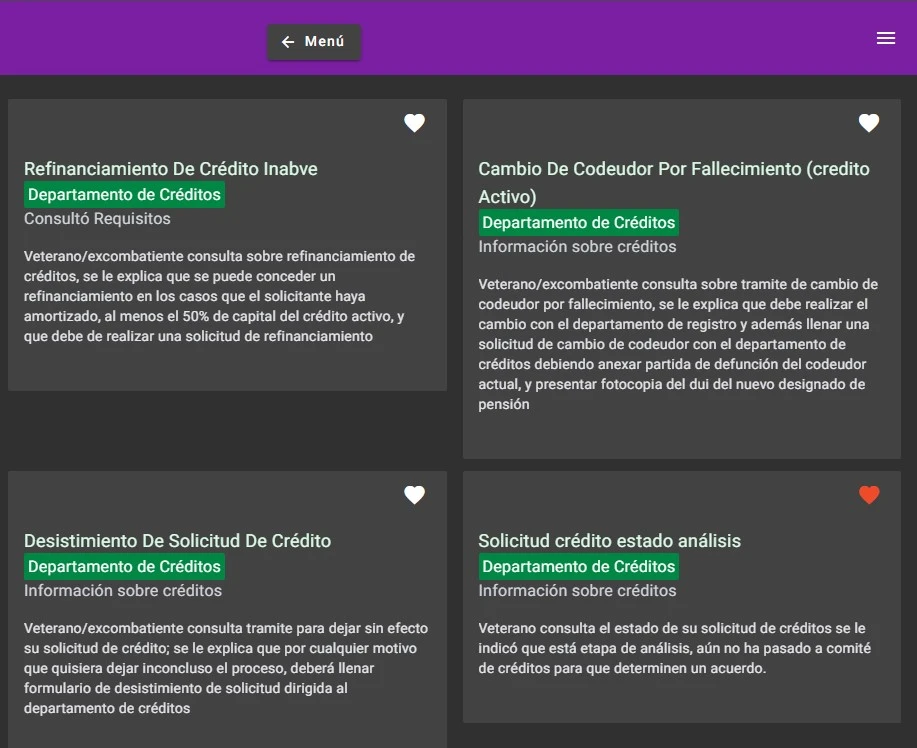
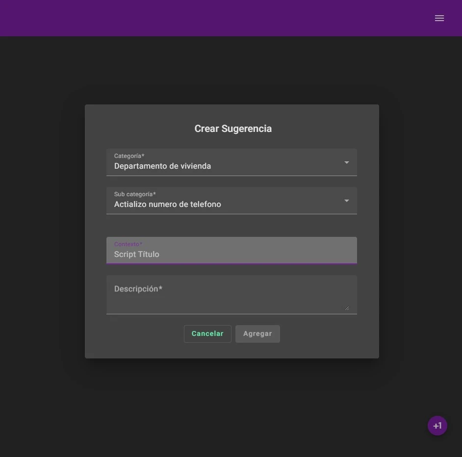

## Table of Contents
1. [Descripción](#descripción)
2. [Rol desempeñado](#rol-desempeñado)
3. [Desafíos y aprendizajes](#desafíos-y-aprendizajes)
4. [Experiencia obtenida](#experiencia-obtenida)

---

## Descripción
Durante mi trabajo en un **call center**, identifiqué un problema operativo que afectaba la eficiencia del departamento. La falta de herramientas adecuadas para el seguimiento de métricas y gestión del tiempo dificultaba la productividad del equipo.  

Para solucionar esto, diseñé e implementé un **software interno** que optimiza la distribución de tareas, mejora la gestión del tiempo y permite a los supervisores tomar decisiones basadas en datos en tiempo real.  

La herramienta fue adoptada por el equipo y **sigue en uso actualmente**, demostrando su impacto positivo en la operación del departamento.

---

## Rol desempeñado
**Desarrollador e Innovador Interno**  
- Identificación del problema y propuesta de una solución técnica.  
- Diseño e implementación del software utilizando **Node.js y Angular**.  
- Integración con sistemas internos del call center para optimizar procesos.  
- Capacitación del equipo en el uso de la herramienta.  

---

## Desafíos y aprendizajes
1. **Automatización de Procesos Manuales:** La implementación del software redujo significativamente las tareas repetitivas, aumentando la eficiencia del equipo.  
2. **Resistencia al Cambio:** Introducir nuevas herramientas en un ambiente no técnico requirió estrategias de adopción y capacitación progresiva.  
3. **Optimización de la UX/UI:** Diseñar una interfaz intuitiva fue clave para que el equipo pudiera aprovechar la herramienta sin curva de aprendizaje elevada.  

---

## Experiencia obtenida
1. **Innovación en entornos no tecnológicos:** Aprendí a desarrollar soluciones en un contexto donde la tecnología no era la prioridad inicial, demostrando su valor estratégico.  
2. **Gestión del Cambio:** Implementar mejoras en una empresa requiere no solo desarrollo técnico, sino también comunicación efectiva con usuarios y líderes.  
3. **Impacto Medible:** La optimización del flujo de trabajo del call center reflejó mejoras en métricas clave como **reducción de tiempos de espera y aumento de productividad**.  

---
